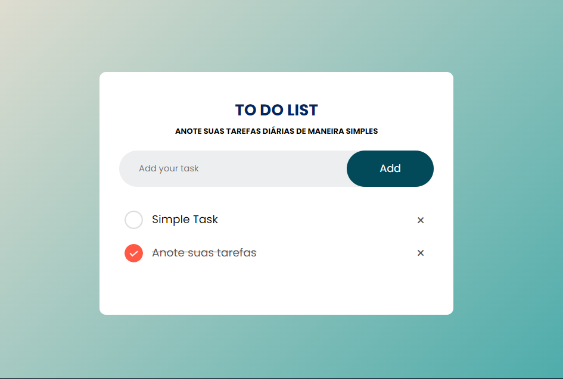

<h1 align="center"> TO DO LIST </h1>

 UMA SIMPLES APLICAÇÃO PARA A ANOTAÇÃO DE TAREFAS 

## Funcionalidades

- **Adicionar Tarefas**: Você pode adicionar novas tarefas à lista simplesmente digitando o texto na barra de entrada
- **Excluir Tarefas**: Cada tarefa tem um botão de exclusão (X) que permite removê-la da lista.
- **Marcar como Concluída**: Clicar em uma tarefa a marcará como concluída, alterando sua aparência para indicar que foi feita.

## Tecnologias Utilizadas

- **HTML**: Utilizado para estruturar a página e criar os elementos da lista de tarefas.
- **CSS**: Utilizado para estilizar a aparência da página e das tarefas.
- **JavaScript**: Utilizado para adicionar interatividade à página, como adicionar, excluir e marcar tarefas.

## Como Utilizar

1. Abra o arquivo `index.html` em seu navegador.
2. Digite uma tarefa na barra de entrada e pressione Enter para adicioná-la à lista.
3. Clique no botão de exclusão (X) para remover uma tarefa.
4. Clique em uma tarefa para marcá-la como concluída.

## Objetivo

O objetivo deste projeto foi praticar a criação de uma aplicação web simples e funcional, utilizando as tecnologias básicas da web (HTML, CSS e JavaScript). A aplicação é uma ótima maneira de praticar a manipulação do DOM, eventos do navegador e armazenamento local (localStorage).

## Conclusão

Este projeto foi uma ótima oportunidade para praticar minhas habilidades em desenvolvimento web. A aplicação é simples, mas funcional, e me ajudou a entender melhor como criar e manipular elementos HTML, estilizar páginas com CSS e adicionar interatividade com JavaScript. Espero que este projeto seja útil para outros desenvolvedores que estão aprendendo a criar aplicações web.

## Imagem

